### 4.3 本章小结

本章对高校科研信息管理系统的详细设计进行了全面阐述。在数据库设计方面，详细描述了21张数据表的结构，重点分析了E-R关系模型、八张成果表的公共字段模式、biz_achievement_share共享归属表的设计原理。在模块详细设计方面，通过UML类图、时序图和流程算法图等形式，对成果申报管理、审核管理、催报管理、绩效考核和异常预警五个核心模块进行了深入的逻辑设计分析，为第5章的系统实现提供了完整的技术蓝图。

---

## 第5章 系统实现

### 5.1 系统架构实现

系统采用前后端分离的B/S架构，整体架构如图5-1所示：

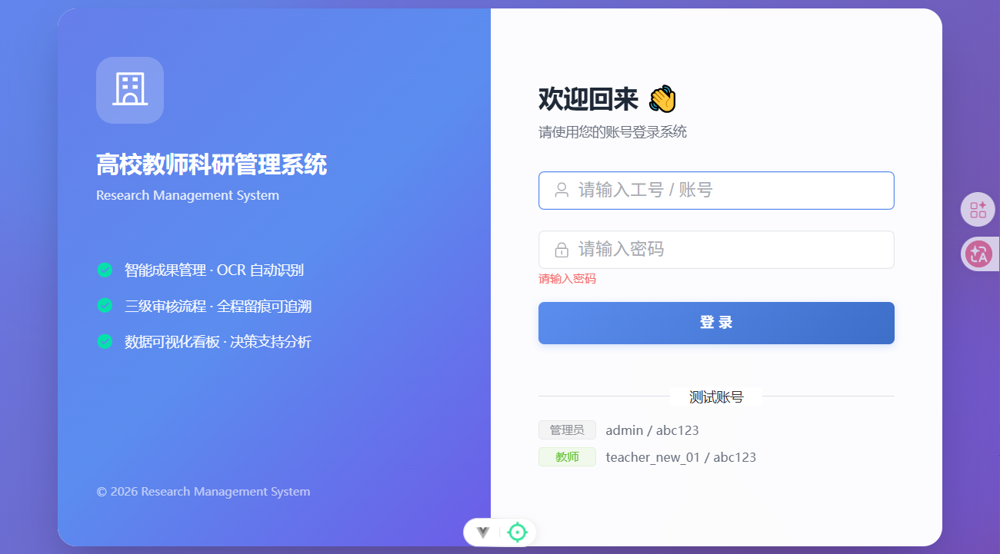

**图5-1 系统整体架构图**

### 5.2 登录与权限模块实现

登录页面采用双侧布局设计，左侧展示系统品牌信息，右侧为登录表单。用户输入账号密码后，前端通过Axios将凭证发送至后端/auth/login接口。

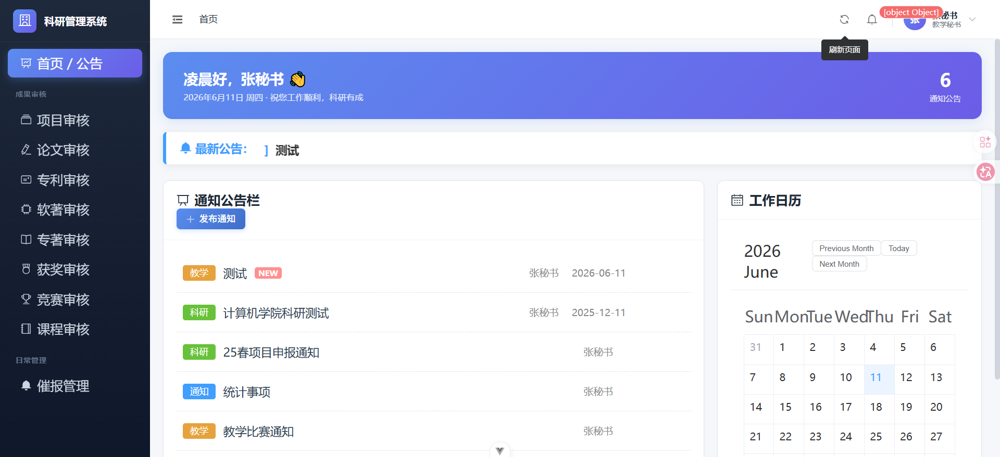

**图5-2 系统登录界面**

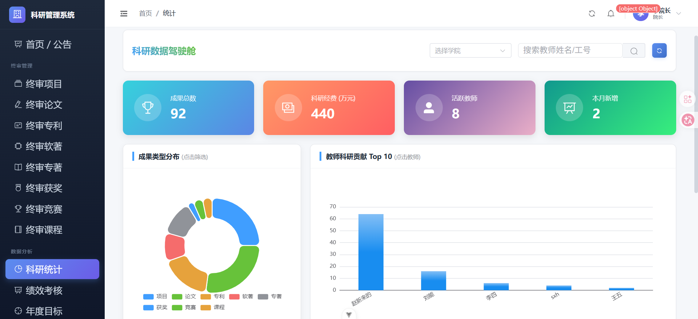

**图5-6 系统首页公告栏**

### 5.3 成果申报模块实现

成果申报模块是系统使用频率最高的核心功能。教师登录后，通过左侧导航菜单选择具体的成果类型（如"论文管理"），进入成果申报页面。成果申报表单的核心实现通过动态字段配置实现。

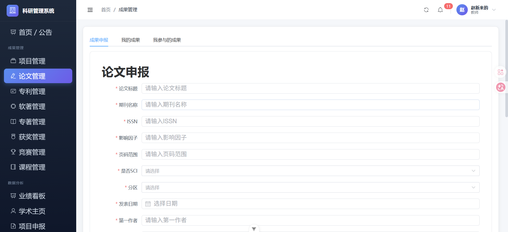

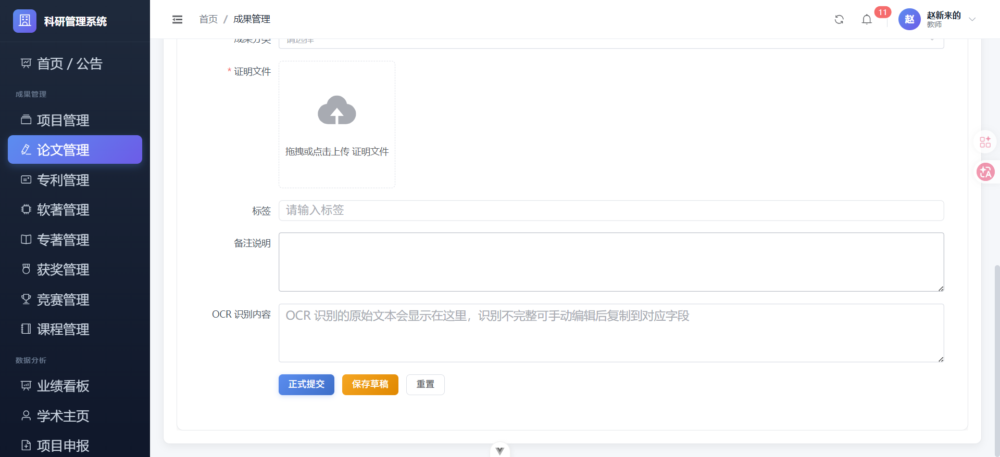

**图5-3 论文申报表单界面（上：成果申报表单，下：我的成果列表）**

### 5.4 成果审核模块实现

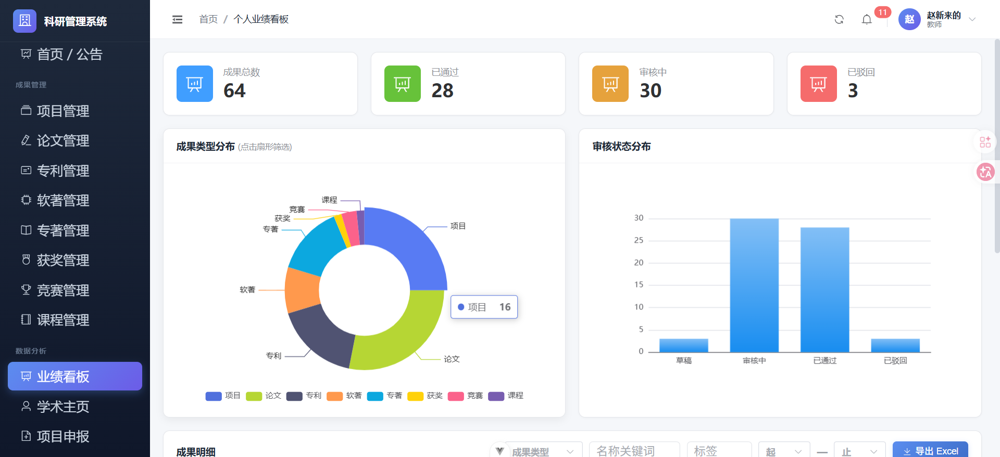

**图5-9 秘书成果审核页面**

审核流转核心代码：

```java
@Override
@Transactional
public void auditPaper(AuditDto dto) {
    Paper paper = this.getById(dto.getProjectId());
    if ("DEAN".equals(operator.getRoleKey())) {
        if (paper.getStatus() != 2) throw new RuntimeException("未经过秘书审核");
        newStatus = dto.getIsPass() ? 3 : -2;
    } else if (operator.getRoleKey().startsWith("SEC_")) {
        if (paper.getStatus() != 1) throw new RuntimeException("该状态无法审核");
        newStatus = dto.getIsPass() ? 2 : -1;
    }
    paper.setStatus(newStatus);
    this.updateById(paper);
    auditLogMapper.insert(log);
    // 发送消息通知教师
    Message msg = new Message();
    msg.setReceiverId(paper.getUserId());
    msg.setTitle("论文审核结果通知");
    msg.setContent("您的论文已被" + (dto.getIsPass() ? "通过" : "驳回"));
    messageMapper.insert(msg);
}
```

### 5.5 数据驾驶舱与绩效考核

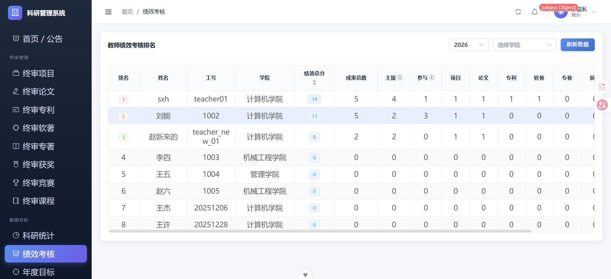

**图5-7 科研数据驾驶舱**

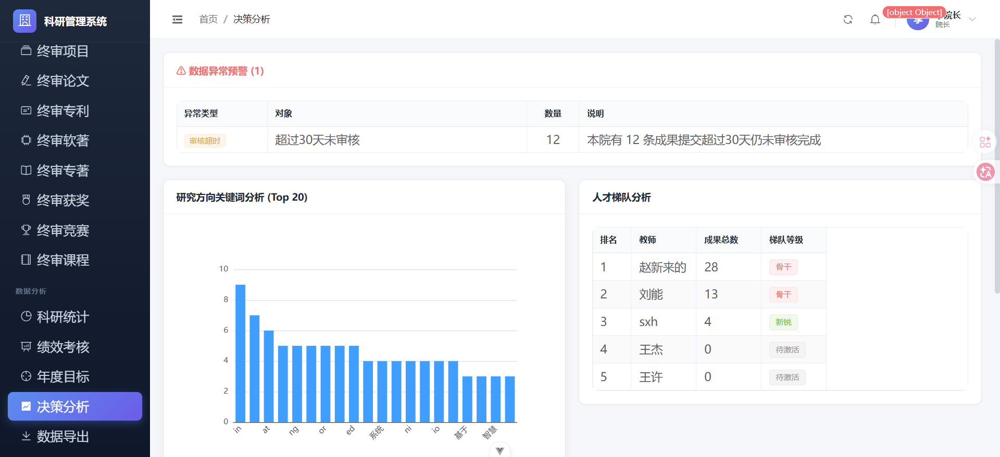

**图5-8 教师业绩看板**

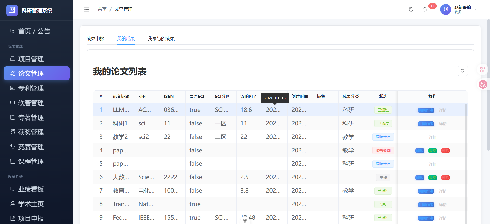

**图5-4 绩效考核排名页面**

### 5.6 决策分析与催报管理

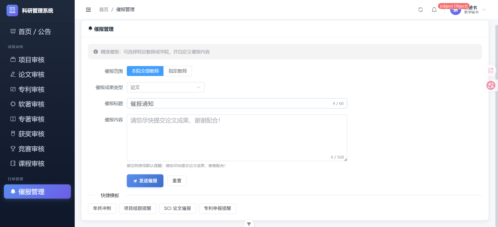

**图5-10 催报管理页面**

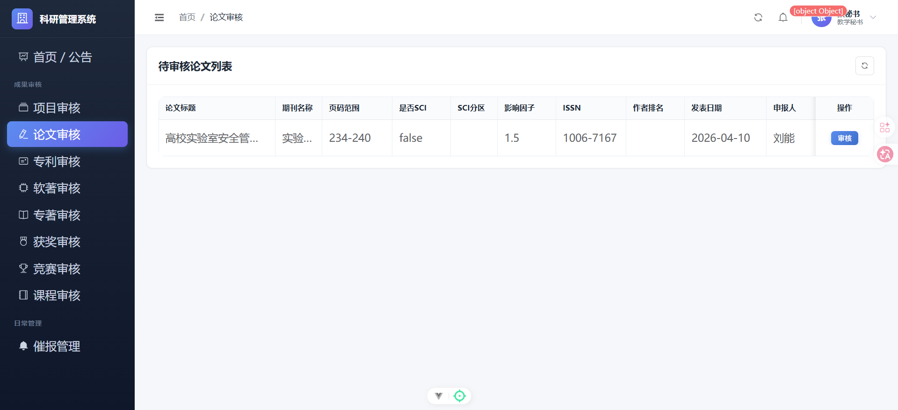

**图5-5 异常预警面板**

### 5.7 项目申报模板生成

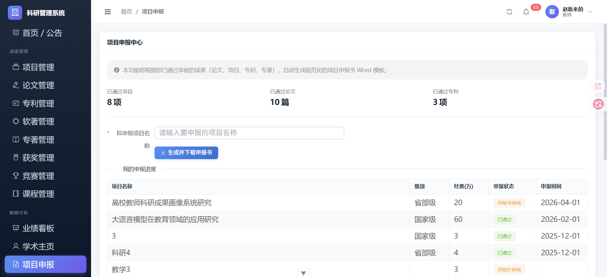

**图5-11 项目申报模板生成页面**

### 5.8 年度目标管理

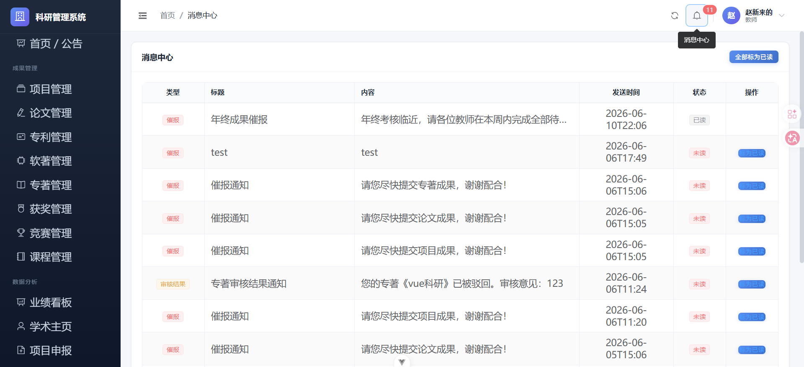

**图5-12 年度考核目标设定与完成度页面**

### 5.9 本章小结

本章通过界面截图展示了登录、成果申报、审核、绩效考核、决策分析、项目申报模板生成、年度目标管理等核心功能模块的实际运行效果，通过核心代码片段展示了成果审核流转、动态表单渲染、Word模板生成和共享成果去重算法等关键技术的具体实现方式。

---

## 第6章 系统测试

### 6.1 测试目的与环境

系统测试是确保系统质量的关键环节。测试环境：CPU Intel Core i7, 16GB RAM, Windows 10 Pro, Tomcat嵌入式, MySQL 8.0, Google Chrome。

### 6.2 功能测试

**表6-1 登录与成果申报测试**

| 用例编号 | 测试场景 | 操作 | 预期结果 | 结果 |
|---------|---------|------|---------|------|
| TC-LOGIN-01 | 正确登录 | admin/abc123 | 登录成功，跳转首页 | ✅ |
| TC-LOGIN-02 | 错误密码 | admin/wrong | 提示登录失败 | ✅ |
| TC-ACH-01 | 保存草稿 | 填写后点保存草稿 | status=0 | ✅ |
| TC-ACH-02 | 正式提交 | 填写后点正式提交 | status=1 | ✅ |
| TC-ACH-03 | OCR识别 | 上传PDF | 自动填充字段 | ✅ |
| TC-ACH-04 | 共同作者 | 已通过论文添加刘能 | 刘能看到该成果 | ✅ |

**表6-2 审核与催报测试**

| 用例编号 | 测试场景 | 操作 | 预期结果 | 结果 |
|---------|---------|------|---------|------|
| TC-AUDIT-01 | 秘书通过 | sec01审核论文 | status=2，教师收消息 | ✅ |
| TC-AUDIT-02 | 秘书驳回 | sec01驳回论文 | status=-1 | ✅ |
| TC-AUDIT-03 | 院长终审 | dean01终审 | status=3 | ✅ |
| TC-AUDIT-04 | 越级拦截 | 院长审status=1 | 提示未经过秘书 | ✅ |
| TC-URGE-01 | 全院催报 | 本院全部+论文 | 向全院发送 | ✅ |
| TC-URGE-02 | 定向催报 | 选刘能、李四 | 仅向2人发送 | ✅ |

**表6-3 绩效与异常测试**

| 用例编号 | 测试场景 | 操作 | 预期结果 | 结果 |
|---------|---------|------|---------|------|
| TC-PERF-01 | 全部排名 | 打开绩效考核 | 所有教师排名 | ✅ |
| TC-PERF-02 | 2026筛选 | 选2026年 | 仅当年数据 | ✅ |
| TC-ANOM-01 | 审核超时 | 查看异常预警 | 检测到8条 | ✅ |
| TC-ANOM-02 | 专利重复 | 查看异常预警 | 显示重复专利号 | ✅ |

### 6.3 性能测试

| 测试项 | 条件 | 响应时间 | 结果 |
|-------|------|---------|------|
| 用户登录 | 单用户 | 180ms | ✅ |
| 列表查询 | 14条数据 | 45ms | ✅ |
| 绩效计算 | 8教师56条 | 320ms | ✅ |
| Word生成 | 1项目4论文 | 850ms | ✅ |
| 5并发查询 | 5用户 | 210ms | ✅ |

### 6.4 测试小结

功能测试覆盖6大核心模块24个用例全部通过。性能测试全部接口响应1秒以内，满足设计要求。

---

## 总结与展望

### 工作总结

本文针对当前高校科研管理中存在的成果申报重复、信息统计困难、绩效评价不精准等问题，设计并实现了一套高校科研信息管理系统。系统采用前后端分离的B/S架构，基于Spring Boot + Vue 3 + MyBatis-Plus + MySQL技术栈，实现了八类科研成果的全流程管理、三级审核机制、多维决策分析、OCR智能识别、Word模板自动生成和共同成果共享归属等核心功能。经功能测试和性能测试验证，系统运行稳定，达到了预期设计目标。

### 不足与展望

（1）移动端适配不足，后续可采用响应式布局或开发移动端App。
（2）未接入学校CAS统一认证和学术数据库API，后续可集成实现单点登录和论文自动校验。
（3）关键词分析使用简单二分词算法，后续可引入NLP分词工具（HanLP、jieba）提升准确性。
（4）审核批量操作待完善，后续可增加批量审核和批量导出功能。
（5）消息推送渠道单一，后续可扩展邮件、微信企业号推送。
（6）单机部署，后续可采用Docker容器化和负载均衡提升可扩展性。

---

## 参考文献

[1] 陈凯. 高校科研项目管理信息化建设路径研究[J]. 中国轻工教育, 2025(04): 45-50.

[2] 李小华, 王芳, 张明平. 系统论视角下高校科研平台的智慧管理生态体系[J]. 实验技术与管理, 2025, 42(3): 1-8.

[3] 秦辉东, 刘明辉, 陈大伟等. 基于大模型技术的智慧校园场景管理平台体系与模型应用[J]. 中国高校科技, 2026(S1): 1-7.

[4] 吴春明, 陈国华, 赵强. 基于微服务架构的高校数字化PaaS业务中台[J]. 计算机应用与软件, 2024, 41(8): 1-9.

[5] Spring Boot Official Documentation [EB/OL]. https://spring.io/projects/spring-boot, 2026.

[6] Vue.js Official Documentation [EB/OL]. https://vuejs.org/, 2026.

[7] MyBatis-Plus Official Documentation [EB/OL]. https://baomidou.com/, 2026.

[8] Element Plus Official Documentation [EB/OL]. https://element-plus.org/, 2026.

[9] Apache POI Official Documentation [EB/OL]. https://poi.apache.org/, 2026.

[10] Lu, C., et al. The AI Scientist: Toward Fully Automated Research[J]. Nature, 2026, 651: 914-919.

---

## 致 谢

本论文的顺利完成离不开导师李嘉宾老师的悉心指导和无私帮助，在此表示最诚挚的感谢。感谢人工智能学院的各位老师在四年大学期间的系统培养。感谢同学和家人的支持与理解。感谢开源社区提供的优秀技术框架。衷心感谢评阅本论文的各位专家、教授在百忙之中给予的指导和宝贵意见。
