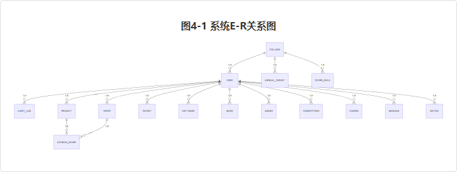
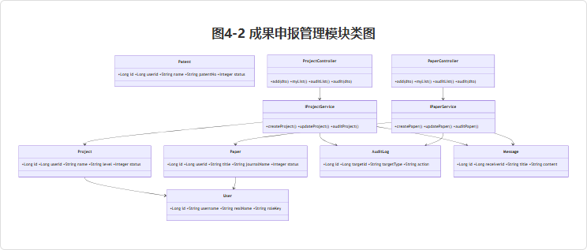
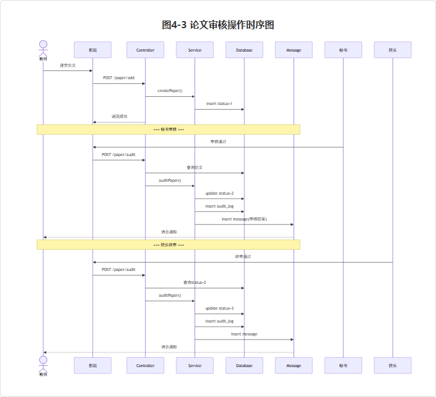
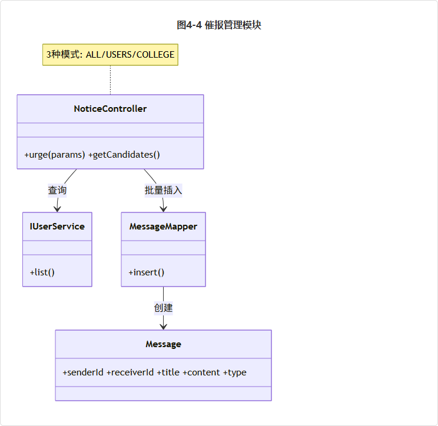
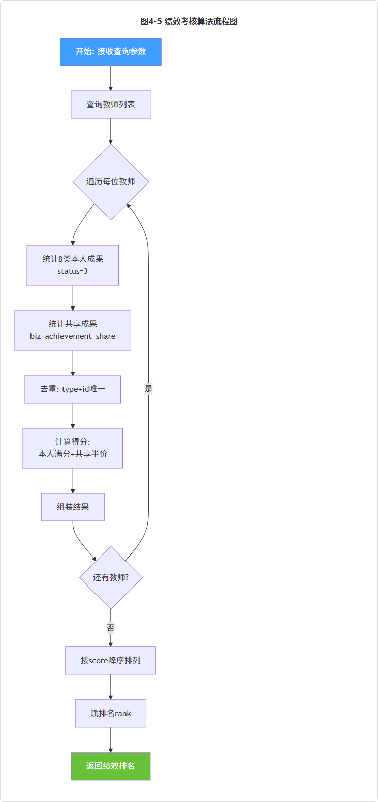
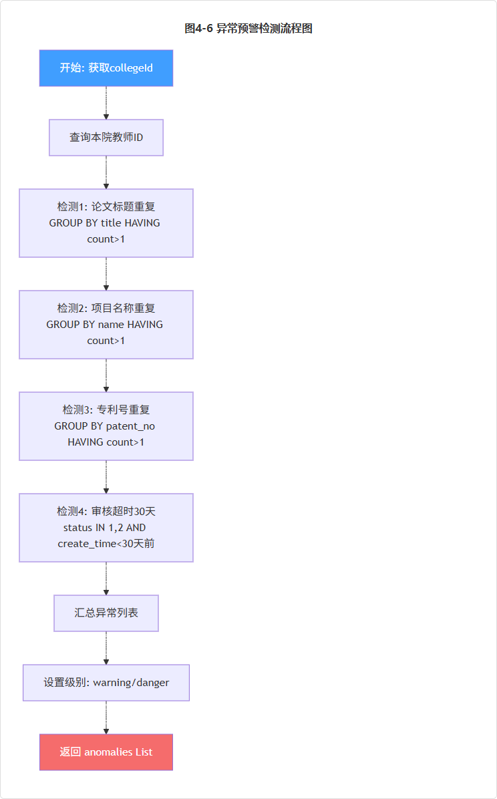

# 高校科研信息管理系统的设计与实现

**Design and Implementation of University Research Information Management System**

---

**学 院：** 人工智能学院  
**专 业：** 软件工程  
**学 号：** 20044120  
**学生姓名：** 孙鑫豪  
**指导教师（校内）：** 李嘉宾 讲师  
**提交日期：** 2026年6月  

---

## 摘 要

随着我国高等教育事业的快速发展和"双一流"建设的深入推进，高校科研活动呈现出项目数量激增、成果形式多样化、学科交叉协同化的发展态势。科技处、各学院作为科研和教学管理的关键部门，面临着繁重的信息管理任务。传统的管理模式依赖人工收集、分散的Excel表格和单一部门级工具，已无法满足当前高校对科研和教学成果精细化管理、信息实时更新、统计分析和成果共享的实际需求。

本文设计并实现了一套高校科研信息管理系统。系统采用B/S架构，后端基于Spring Boot框架和MyBatis-Plus持久层技术，前端采用Vue 3框架和Element Plus组件库，数据库选用MySQL。系统针对五种用户角色——教师、教学秘书、科研秘书、院长和管理员——分别提供差异化的功能模块。教师端实现了八类科研成果的在线申报、附件上传、OCR智能识别填充、标签管理、个人学术主页和成果导出等功能；秘书端实现了成果审核、催报管理和公告发布；院长端提供了科研数据驾驶舱、绩效考核排名、年度目标管理、决策分析（异常预警、关键词分析、人才梯队分析、资源分配建议）等综合统计功能；管理员端实现了用户管理、学院管理和动态评分规则配置。

系统还引入了一系列创新功能：基于Apache POI的项目申报书Word模板自动生成，从教师已有成果库中自动提取论文、项目、专利、专著等信息填入规范化申报文档；多人共同成果共享机制，通过成果共享归属表解决同一科研成果被多位教师重复申报导致的统计重复计算问题，绩效考核中共享成果以50%权重计入参与者得分；基于Apache PDFBox和Apache POI的OCR智能识别功能，自动解析证明材料内容并映射填充至表单字段。系统经功能测试和性能测试，各项指标满足设计要求，操作界面友好，具有良好的实用性和可扩展性。

**关键词：** 科研管理；Spring Boot；Vue.js；绩效考核；管理系统

---

## Abstract

With the rapid development of higher education in China and the deepening of the "Double First-Class" initiative, university research activities show trends of surging project numbers, diversified output forms, and interdisciplinary collaboration. The Science and Technology Department and academic colleges, as key units for research and teaching management, face heavy information management tasks. Traditional management models relying on manual collection, scattered Excel spreadsheets, and single-purpose departmental tools can no longer meet the practical needs for refined management, real-time information updates, statistical analysis, and achievement sharing of research and teaching outcomes.

This thesis designs and implements a University Research Information Management System. The system adopts B/S architecture, with a Spring Boot framework and MyBatis-Plus persistence layer on the backend, Vue 3 framework and Element Plus component library on the frontend, and MySQL as the database. The system serves five user roles—Teacher, Teaching Secretary, Research Secretary, Dean, and Administrator—each with differentiated functional modules. The Teacher module implements online submission of eight types of research achievements, file upload, OCR intelligent recognition and form filling, tag management, personal academic homepage, and data export. The Secretary module implements achievement review, reminder management, and announcement publishing. The Dean module provides a research data dashboard, performance ranking, annual target management, and decision analysis (anomaly detection, keyword analysis, talent tier analysis, resource allocation suggestions). The Administrator module implements user management, college management, and dynamic scoring rule configuration.

The system also introduces several innovative features: automatic Word template generation for project applications using Apache POI, which extracts existing achievements (papers, projects, patents, books) from the teacher's portfolio and populates standardized application documents; a multi-author achievement sharing mechanism that uses a sharing relationship table to solve the problem of duplicate counting when multiple teachers report the same achievement, with shared achievements weighted at 50% for participant scoring in performance evaluation; and OCR intelligent recognition based on Apache PDFBox and Apache POI, which automatically parses supporting document content and maps it to form fields. The system has passed functional testing and performance testing, with all indicators meeting design requirements, a user-friendly interface, and good practicality and extensibility.

**Keywords:** Research Management; Spring Boot; Vue.js; Performance Evaluation; Management System

---

## 目 录

- [第1章 绪论](#第1章-绪论)
  - 1.1 项目研究背景
  - 1.2 国内外研究现状
  - 1.3 项目研究目的和意义
  - 1.4 论文结构及章节安排
  - 1.5 本章小结
- [第2章 系统分析](#第2章-系统分析)
  - 2.1 项目目标
  - 2.2 业务流程分析
  - 2.3 系统主要业务流程
  - 2.4 本章小结
- [第3章 系统总体设计](#第3章-系统总体设计)
  - 3.1 功能设计
  - 3.2 模块设计
  - 3.3 数据库设计
  - 3.4 系统非功能设计
  - 3.5 开发环境选择
  - 3.6 本章小结
- [第4章 系统详细设计](#第4章-系统详细设计)
  - 4.1 系统数据库详细设计
  - 4.2 模块详细设计
- [第5章 系统实现](#第5章-系统实现)
- [第6章 系统测试](#第6章-系统测试)
- [总结与展望](#总结与展望)
- [参考文献](#参考文献)
- [致谢](#致谢)

---

## 第1章 绪论

### 1.1 项目研究背景

随着信息技术的飞速发展和我国高等教育事业的持续推进，高校科研活动在规模和复杂性上均呈现出快速增长的趋势。特别是"双一流"建设战略实施以来，高校科研项目数量大幅增加，科研成果形式日趋多元化，涵盖科研论文、科研项目、专利、软件著作权、学术专著、获奖成果、学科竞赛、课程建设等多种类型[1]。与此同时，教师的绩效考核、职称评定和项目申报等环节对科研成果数据的准确性、完整性和可追溯性提出了更高的要求。

然而，当前许多高校的科研管理工作仍然依赖传统的人工管理方式。教师需要反复填报相同的成果信息，科技处和学院管理人员需要手动汇总Excel表格，统计工作耗时费力且容易出现遗漏和错误[2]。不同部门之间缺乏统一的信息共享平台，导致"信息孤岛"现象严重——科研处有科研处的系统，教务处有教务处的系统，两者之间数据无法互通。教师在申报科研项目时需要重复填写已有的成果信息，管理人员在年终统计时需要从多个来源手工汇总，效率低下且无法保证数据的准确性和一致性。

因此，建设一套集成化的高校科研信息管理系统，实现从教师成果申报、学院审核、学校统计到绩效考核的全流程信息化管理，已成为高校信息化建设的迫切需求。

### 1.2 国内外研究现状

#### 1.2.1 国内研究现状

近年来，国内高校和学者在科研管理信息化方面进行了大量探索。陈凯[1]在《高校科研项目管理信息化建设路径研究》中指出，我国高校科研管理信息化建设经历了从单机管理到网络化管理的演进过程，但系统集成度普遍不高，业务流程覆盖不全面，数据共享与交换存在困难。早期开发的高校科研管理系统大多基于传统的SSH或SSM框架，功能相对简单，主要集中在科研项目的申报和经费管理上，对教学成果的管理和教师绩效考核的支持不足[3]。

随着Spring Boot、Vue.js等现代Web开发框架的普及，一些高校开始尝试采用前后端分离架构开发新一代科研管理系统。例如，基于Spring Boot的高校科研项目管理系统实现了项目申报、成果登记等基础功能，但在成果审核流程的深度定制、教师个人业绩看板的可视化展示以及与学校统一认证系统的对接方面仍存在改进空间。此外，现有系统普遍缺乏对科研成果智能识别的支持，教师在上传证明材料后仍需手工填写大量元数据信息，OCR技术在此场景下的应用尚未普及。

#### 1.2.2 国外研究现状

在国外，高校科研信息系统（Research Information Systems, RIS）的发展相对较为成熟。以美国和欧洲为代表的高校已广泛应用商业化的科研管理信息系统，如InfoEd、Elsevier PURE、Symplectic Elements等[2]。这些系统功能强大，覆盖了科研项目、经费、成果、人员和设施的全方位管理，并且高度注重数据的标准化和互操作性，能够与学校其他管理系统无缝集成。

同时，这些成熟的RIS产品也强调对科研影响力的量化分析，能够为高校的科研战略规划提供数据驱动的决策支持。例如，Elsevier PURE系统能够自动从Web of Science、Scopus等学术数据库中抓取教师的论文发表数据，并提供引文分析和研究影响力评估。然而，这些商业系统价格昂贵，本地化适配难度大，且不完全符合中国高校的教学成果和科研并重的管理特点。此外，国外系统在中国的部署还需要考虑数据跨境传输的合规性问题。这些因素使得直接引入国外成熟产品并非最优选择，开发符合国内高校实际需求的自研系统仍具有重要的现实意义。

### 1.3 项目研究目的和意义

本项目旨在设计并实现一套功能完善、操作便捷、安全可靠的高校科研信息管理系统，具体目标包括：

（1）**构建统一成果管理平台**：实现科研论文、科研项目、专利、软件著作权、学术专著、获奖成果、学科竞赛、课程建设等八类成果的在线申报、附件上传、审核流转和统计分析，解决教师"一次填报、多场景复用"的实际需求。

（2）**实现三级审核流程**：建立教师提交→秘书初审→院长终审的三级审核机制，确保成果数据的准确性和权威性，审核日志全程可追溯。

（3）**提供多维度数据分析与决策支持**：为学院领导提供科研数据驾驶舱、绩效考核排名、年度目标管理、异常数据预警、研究方向关键词分析和人才梯队分析等决策支持功能，为科研管理提供数据驱动的决策依据。

（4）**引入智能化辅助功能**：通过OCR智能识别技术自动解析证明材料内容并填充表单，通过Apache POI自动生成规范化的项目申报书Word模板，减少教师重复劳动。

（5）**解决统计重复计算问题**：引入多人共同成果共享机制，通过成果共享归属表实现同一成果的归属化管理，避免多位作者重复申报导致的统计偏差。

本系统的开发与应用，对于提升高校科研管理的信息化水平、规范科研管理流程、提高管理效率、降低人工统计的出错率具有重要的实践意义。

### 1.4 论文结构及章节安排

本文共分为六个章节，具体结构安排如下：

- **第1章 绪论**：介绍项目的研究背景、国内外研究现状、研究目的和意义以及论文的组织结构。
- **第2章 系统分析**：明确系统建设目标，进行详细的业务流程分析，描述六大核心业务流程。
- **第3章 系统总体设计**：对系统进行总体规划，包括功能模块设计、数据库设计、非功能需求设计和开发环境选择。
- **第4章 系统详细设计**：对数据库逻辑结构和物理结构进行详细设计，并结合实际代码对主要模块进行详细设计。
- **第5章 系统实现**：展示系统主要功能模块的实现效果，包括界面截图和核心代码片段。
- **第6章 系统测试**：设计测试用例对系统进行功能测试和性能测试，验证系统是否满足设计要求。
- **总结与展望**：对本系统的设计与开发工作进行总结，指出存在的不足，并对后续改进方向进行展望。

### 1.5 本章小结

本章阐述了高校科研信息管理系统的研究背景，通过对国内外研究现状的分析，明确了当前高校科研管理信息化建设中存在的"信息孤岛"、系统集成度不高、功能覆盖不全面等问题。在此基础上，阐述了本项目的五个核心研究目标：构建统一成果管理平台、实现三级审核流程、提供多维度数据分析与决策支持、引入智能化辅助功能以及解决统计重复计算问题，为后续章节的技术实现奠定了基础。

---

## 第2章 系统分析

### 2.1 项目目标

本项目旨在开发一套适合国内高校实际情况的科研信息管理系统，具体建设目标如下：

（1）为教师提供便捷的成果申报入口，支持八类科研成果的在线填报、文件上传和修改撤回，减少教师在成果填报上的重复劳动。

（2）为秘书提供高效的成果审核工具，支持对所有教师申报的成果进行初审审核，提供催报功能，对未按时提交成果的教师进行精准催报。

（3）为院长提供全面的数据分析平台，支持全院科研成果的统计、绩效考核、决策分析和数据导出，为科研管理决策提供数据支持。

（4）为管理员提供完善的后台管理功能，包括用户管理、学院管理和动态评分规则配置，确保系统权限和规则的灵活管理。

（5）系统需具备良好的安全性、可扩展性和用户友好的操作界面，确保不同角色的用户能够快速上手。

### 2.2 业务流程分析

#### 2.2.1 用户特点

本系统面向五类用户角色，各角色的特点和需求如下：

- **教师（TEACHER）**：系统的主要用户，需要录入和管理自己的科研和教学成果，查看个人业绩统计。
- **科研秘书（SEC_RESEARCH）**：负责科研类成果的审核和科研数据统计。
- **教学秘书（SEC_TEACHING）**：负责教学类成果的审核和教学数据统计。
- **院长（DEAN）**：对学院科研成果进行终审审核，查看全院科研数据统计、绩效考核、决策分析等。
- **管理员（ADMIN）**：负责用户管理、学院管理和系统评分规则配置。

#### 2.2.2 流程分析对象现状

当前高校科研管理的典型流程中，教师在发表论文或获得专利后，通常需要向科技处提交纸质或电子版证明材料。科技处或学院秘书收到材料后，进行手工审核和登记。年终进行科研成果统计时，管理人员需要从多个来源手工汇总数据，经常出现遗漏、重复和格式不统一等问题。教师在不同场景下（职称评审、项目申报、年度考核）需要反复提供相同的成果清单，重复工作量巨大。

#### 2.2.3 适用范围

本系统适用于高校的科研管理和教学成果管理场景，覆盖从教师个人成果申报、学院秘书审核、学院领导终审、学校管理员全局管理到年终绩效考核的全业务流程。

#### 2.2.4 业务流程图

系统总体业务流程如下图所示（文字描述）：

```
教师登录 → 选择成果类型 → 填写申报信息 + 上传证明文件
→ 提交审核（或保存草稿）
→ 秘书登录 → 查看待审核成果 → 审核通过（进入待院长审队列）
  或 审核驳回（退回教师修改）
→ 院长登录 → 终审通过（成果入库，计入统计）
  或 终审驳回（退回秘书重审）
→ 成果数据进入统计看板 → 绩效考核自动计算
```

### 2.3 系统主要业务流程

#### 2.3.1 成果申报管理流程

成果申报是教师端的核心功能。教师登录系统后，在成果管理模块选择具体的成果类型（论文/项目/专利/软著/专著/获奖/竞赛/课程），进入申报界面。申报界面根据所选的成果类型动态生成对应的表单字段，例如论文申报包含标题、期刊名称、ISSN号、影响因子、SCI分区、发表日期、作者信息等；项目申报包含项目名称、项目来源、级别、经费预算、起止日期等。

教师填写表单后可以选择"保存草稿"（状态设为0）或"正式提交"（状态设为1）。提交后，成果进入待审核队列。在秘书审核之前，教师可以修改或撤回已提交的成果。

系统还支持OCR智能识别功能：教师上传论文PDF或项目Word证明文件后，系统自动提取文件中的关键信息（标题、作者、期刊名、日期等）并映射填充至对应的表单字段，显著减少手工输入的工作量。

#### 2.3.2 成果审核管理流程

成果审核管理是秘书和院长端的核心功能。教师提交成果后，成果状态变为1（待秘书审核）。秘书登录后在审核页面可以看到所有待审核的成果，按成果类型分为八个审核子模块。

**初审（秘书审核）**：秘书对教师提交的成果进行审核。首先检查成果信息的完整性和准确性，验证证明材料是否规范有效。审核通过后，成果状态变为2（待院长审核）；审核驳回后，成果状态变为-1（秘书驳回），教师可查看驳回意见并修改后重新提交。

**终审（院长审核）**：院长在终审页面中可以看到已通过秘书初审的成果。院长进行最终审核：通过后成果状态变为3（已通过，计入统计）；驳回后成果状态变为-2（院长驳回）。每一级审核操作都会记录到审核日志表中，确保审核过程可追溯。

#### 2.3.3 催报管理流程

催报管理是秘书端的重要管理功能。在成果申报截止日期临近时，秘书可以使用催报功能通知未提交成果的教师。系统支持三种催报模式：

- **全院催报**：自动向本院所有教师发送催报消息。
- **定向催报**：秘书从教师多选列表中选择特定教师进行精准催报。
- **按学院催报**（管理员）：管理员可以跨学院选择目标群体。

催报时可以选择具体的成果类型，自定义催报标题和内容，系统还提供了"年终冲刺""项目结题提醒""SCI论文催报""专利申报提醒"等快捷模板。

#### 2.3.4 绩效考核管理流程

绩效考核是院长端的核心统计功能。院长在绩效考核页面可以按年份和学院筛选查看所有教师的绩效排名。系统自动对每位教师的已通过成果进行评分计算：

- **本人成果满分计入**：教师自主申报并通过审核的成果，按评分规则计算得分。
- **共享成果半价计入**：其他教师申报但共享给本人的成果，以50%权重计入总分。
- **去重机制**：通过成果共享归属表进行去重，避免同一成果被多位教师重复计数。

绩效考核排名实时更新，支持按年份切换查看历史和当前数据。评分规则由管理员在后台按年度进行配置，不同年份可以设定不同的分数权重（如2026年国家级项目5分、SCI一区论文5分等）。

#### 2.3.5 数据统计与分析流程

院长端提供科研数据驾驶舱，以可视化方式展示全院科研成果的整体概览。驾驶舱包含：

- **核心指标卡片**：成果总数、科研经费总额、活跃教师数、本月新增成果数。
- **成果类型分布饼图**：展示八类成果的占比情况，点击扇形可筛选对应类型的详细列表。
- **教师贡献排名柱状图**：展示科研成果Top 10教师排名，点击柱子可查看该教师的成果明细。
- **学院科研趋势折线图**：按时间维度展示各类成果的年度变化趋势。

此外，决策分析模块还提供异常数据预警（检测论文/项目重复申报、专利号重复、审核超时等）、研究方向关键词分析（通过成果名称进行高频词提取）和人才梯队分析（按成果数量对教师进行分类评级）。

#### 2.3.6 公告与消息推送流程

系统提供完善的内部消息和公告推送机制：

- **公告发布**：秘书可在首页公告栏发布通知公告，支持上传附件（Word/PDF格式），系统自动解析附件文本供在线预览。公告附带分类标签（全校通知/教学通知/科研通知），根据分类定向推送给相关用户。
- **消息通知**：审核结果自动以消息形式发送给对应教师（"您的论文《XXX》已通过审核"）。催报通知、系统公告也通过消息通道推送。教师在消息中心可以查看所有消息，支持单条已读和全部已读操作。
- **新公告弹窗提醒**：教师首次登录时，如有未读的新公告，系统自动弹出提醒弹窗，确保重要通知不会被遗漏。
- **消息偏好设置**：教师可以在个人设置中选择是否接收审核结果通知、催报通知、系统公告等各类消息。

### 2.4 本章小结

本章通过对高校科研管理的实际业务流程进行深入分析，明确了系统的五大建设目标，对五类用户角色的特点和使用需求进行了详细阐述。重点描述了六大核心业务流程：成果申报管理、成果审核管理、催报管理、绩效考核管理、数据统计与分析以及公告与消息推送。通过业务流程分析梳理了系统的功能边界和核心交互逻辑，为后续系统的总体设计提供了明确的业务指导。

---

## 第3章 系统总体设计

### 3.1 功能设计

#### 3.1.1 系统功能

根据系统分析阶段梳理的业务需求，高校科研信息管理系统划分为以下功能模块：

（1）**教师端功能**：个人信息维护、八类成果申报与管理、个人业绩看板、学术主页、项目申报模板生成、消息中心。

（2）**秘书端功能**：八类成果审核、催报管理、通知公告管理。

（3）**院长端功能**：八类成果终审、科研数据驾驶舱、绩效考核排名、年度目标管理、决策分析（异常预警/关键词分析/人才梯队分析/资源分配建议）、数据导出。

（4）**管理员端功能**：用户管理、学院管理、评分规则配置。

（5）**公共功能**：用户登录与认证、消息通知、公告查看、消息偏好设置。

#### 3.1.2 功能结构设计

系统采用前后端分离的B/S架构，前端基于Vue 3框架和Element Plus组件库，后端基于Spring Boot框架和MyBatis-Plus持久层技术，数据库选用MySQL。系统的总体功能结构如下图所示（以模块树形式描述）：

```
高校科研信息管理系统
├── 用户认证模块
│   ├── JWT登录
│   └── 角色权限控制（5种角色）
├── 成果管理模块
│   ├── 科研论文管理
│   ├── 科研项目管理
│   ├── 专利管理
│   ├── 软件著作权管理
│   ├── 学术专著管理
│   ├── 获奖成果管理
│   ├── 学科竞赛管理
│   └── 课程建设管理
├── 审核管理模块
│   ├── 秘书初审
│   ├── 院长终审
│   └── 审核日志
├── 通知与消息模块
│   ├── 通知公告发布/查看
│   ├── 消息推送（审核结果/催报/系统）
│   └── 新公告弹窗提醒
├── 催报管理模块
│   ├── 全院催报
│   ├── 定向催报（按教师）
│   └── 跨院催报（管理员）
├── 统计与分析模块
│   ├── 科研数据驾驶舱（饼图/柱状图/折线图）
│   ├── 绩效考核排名（年度/学院/主报+参与）
│   ├── 年度目标设定与完成度
│   └── 决策分析（异常预警/关键词/人才梯队/资源建议）
├── 项目申报模块
│   └── 申报书Word模板自动生成
├── 系统管理模块
│   ├── 用户管理
│   ├── 学院管理
│   └── 评分规则配置（按年度）
└── 个人设置模块
    ├── 消息偏好设置
    └── 个人信息修改
```

### 3.2 模块设计

#### 3.2.1 成果申报管理模块

该模块是教师端的核心功能，支持八类科研成果的完整生命周期管理：

- **新增成果**：教师选择成果类型（论文/项目/专利/软著/专著/获奖/竞赛/课程），系统根据类型动态生成对应的表单。支持输入框、下拉选择、日期选择、多行文本和文件上传等多种表单控件。表单包含必填项校验，避免不完整提交。
- **保存草稿**：教师可随时将未填完的申报信息保存为草稿（状态=0），草稿状态的成果仅自己可见，可随时编辑和删除。
- **正式提交**：教师完成表单后点击"正式提交"，成果进入待审核状态（状态=1），不可再编辑。
- **修改与撤回**：在审核前（状态=1），教师可撤回提交回到草稿状态；秘书驳回后，教师可查看驳回意见并修改后重新提交。
- **OCR智能识别**：教师上传PDF或Word证明文件后，后端的OCRController调用Apache PDFBox和Apache POI解析文件内容，提取关键信息（标题、作者、日期等）并返回前端自动填充。支持论文、专利、软著、专著等不同成果类型的识别规则。
- **成果标签管理**：教师可为每项成果添加自定义标签（逗号分隔），便于后续按照标签分类查找和筛选。
- **共同作者管理**：已通过审核的成果，教师可以通过"共同作者"功能将成果共享给系统中的其他教师。被共享的教师可在"我参与的成果"中查看该成果，但无法编辑或删除。

#### 3.2.2 成果审核管理模块

该模块分为秘书审核和院长终审两个子模块：

- **秘书审核页面**：秘书登录后可查看自己学院内所有待审核的成果（状态=1）。审核操作包括查看成果详情、预览证明材料文件。审核通过后成果状态变为2（待院长审核）；审核驳回后成果状态变为-1（秘书驳回），需填写驳回原因。审核日志自动记录操作人和时间。
- **院长终审页面**：院长登录后可查看已通过秘书初审的成果（状态=2）。终审通过（状态=3，计入统计）或驳回（状态=-2，院长驳回）。院长只能审核已通过秘书初审的成果，无法越级操作。
- **审核意见模板**：系统提供常用驳回理由模板（如"附件不清晰""作者信息不全"等），秘书/院长可快速选择或自定义填写。
- **消息通知联动**：每次审核操作完成后，系统自动向该成果的申报教师发送消息，通知其审核结果。消息包含成果名称、审核结果、审核意见等信息。

#### 3.2.3 催报管理模块

催报管理模块允许秘书和管理员向教师发送催报通知：

- **催报范围选择**：支持全院教师、指定教师（多选，按姓名/工号搜索）、指定学院（管理员专属）三种模式。
- **成果类型指定**：选择催报的具体成果类型（8种），系统自动生成默认提醒文案。
- **自定义催报内容**：可自定义催报标题和正文内容，支持字数统计。
- **快捷模板**：提供"年终冲刺""项目结题提醒""SCI论文催报""专利申报提醒"四个预设模板，一键填充。
- **发送确认**：发送前弹出二次确认对话框，显示催报对象数和标题，避免误发。

#### 3.2.4 绩效考核管理模块

绩效考核管理模块为院长提供按年度和学院维度的教师绩效评分与排名：

- **评分规则**：管理员在后台按年度配置各类成果的分值权重。默认规则为：项目类5分（国家级）、论文类5分（SCI一区）、专利类3分（发明专利）等，共26条评分规则，分属8类成果。
- **本人成果满分计入**：教师自主申报并通过审核的成果，按配置的评分规则满分计算得分。
- **共享成果半价计入**：其他教师通过共享机制分享给本人的成果，以50%权重计入总分。
- **去重机制**：通过biz_achievement_share表的（成果类型+成果ID）组合进行唯一性判断，避免同一论文/项目的重复计分。
- **排名展示**：按学院和年份筛选，展示教师排名、姓名、工号、学院、绩效总分、主报成果数、参与成果数等指标。Top 3用彩色标签高亮显示。

#### 3.2.5 决策分析模块

决策分析模块为院长提供多维度的深度分析：

- **异常预警**：自动检测论文标题重复、项目重名、专利号重复等异常数据，以及超过30天未完成审核的挂起记录。异常项的严重程度按不同颜色标签（danger/warning）区分。
- **研究方向关键词分析**：对教师已通过成果的名称进行文本分词，提取高频关键词（Top 20），以柱状图形式展示，帮助领导和院长识别学院当前的研究热点和方向。
- **人才梯队分析**：按教师成果总数的阶梯分布（骨干≥10项、中坚≥5项、新锐>0项、待激活=0项）进行分类评级，以表格形式展示。
- **资源分配建议**：按成果类型维度的占比分布，识别学院当前的薄弱环节（如获奖类成果仅占0%），给出高/中/低优先级的资源倾斜建议，为学院资源配置提供数据参考。

#### 3.2.6 公告与消息推送模块

- **公告发布**：秘书登录后在首页公告栏点击"发布通知"，填写标题、分类（全校/教学/科研）、正文内容，可选上传Word或PDF附件。发布后公告出现在所有用户的首页公告栏中。
- **消息推送**：系统在以下场景自动生成消息：审核结果通知、催报通知、系统通知。消息记录包含发送者、接收者、标题、正文、消息类型、关联成果ID等信息。
- **消息中心**：提供统一的消息查看页面，支持分类型查看（审核结果/催报/通知/系统），支持单条已读、全部已读操作。未读消息以红色标签标识，顶部导航栏以徽标数字展示未读数量。
- **新公告弹窗**：教师首次进入系统时，若有未读的新公告，自动弹出提醒弹窗。弹窗基于localStorage记录的上次已看公告ID判断，确保每条新公告教师至少看到一次。

### 3.3 数据库设计

#### 3.3.1 数据库环境说明

系统采用MySQL 8.0作为数据库管理系统，使用utf8mb4字符编码以支持中英文和特殊字符的存储。数据库名称为school_research_db。数据持久化层使用MyBatis-Plus框架，通过LambdaQueryWrapper进行类型安全的数据库查询，通过@TableLogic注解实现软删除。

#### 3.3.2 表结构设计

系统数据库共包含21张数据表（以下为核心表说明，详细信息见第4章）：

**用户与组织表：**
- sys_user：用户表（id, username, password, real_name, college_id, role_key, is_first_login, create_time, update_time, is_deleted）。存储所有系统用户信息，role_key区分五类角色。
- sys_college：学院表（id, name, create_time, update_time, is_deleted）。

**成果表（biz_系列，8张）：**
- biz_project：科研项目表
- biz_paper：科研论文表
- biz_patent：专利表
- biz_software_copyright：软件著作权表
- biz_book：学术专著表
- biz_award：获奖成果表
- biz_competition：学科竞赛表
- biz_course：课程建设表

每张成果表均包含：id, user_id, status（0草稿/1待秘书审/2待院长审/3已通过/-1秘书驳回/-2院长驳回）, tags（标签）, classification（科研/教学分类）, create_time, update_time, is_deleted 等公共字段，以及各自的特有字段（如论文的title, journal_name, issn, impact_factor等）。

**业务流程表：**
- sys_audit_log：审核日志表
- sys_notice：通知公告表
- sys_message：消息通知表
- biz_achievement_share：成果共享归属表

**配置表：**
- sys_score_rule：评分规则表
- sys_message_preference：消息偏好表
- sys_annual_target：年度考核目标表

### 3.4 系统非功能设计

**安全性**：系统采用JWT（JSON Web Token）实现无状态认证，用户登录后获取Token，后续请求在Header中携带Token进行身份校验。密码使用BCrypt加密存储。系统通过Spring Security实现接口级别的访问控制，并配合@PreAuthorize注解实现方法级别的权限校验。CORS跨域配置仅允许来自前端地址的请求。

**可靠性**：系统采用Spring事务管理（@Transactional注解）保证数据一致性，关键业务操作（成果提交、审核、消息发送）在同一事务中完成。数据库使用InnoDB引擎支持事务和崩溃恢复。

**性能**：前端使用Vite构建工具进行代码压缩和Tree-shaking优化，减少前端资源体积。MyBatis-Plus在频繁查询场景下使用索引优化（user_id、status、college_id等字段建立索引）。前端采用动态导入（dynamic import）实现代码分割和按需加载。

**可维护性**：代码采用分层架构（Controller → Service → Mapper），遵循单一职责原则。前后端分离的架构使得前端和后端可以独立开发、独立部署、独立维护。

**用户体验**：前端基于Element Plus组件库，提供统一的视觉风格和交互规范。表单支持客户端校验，减少无效提交。关键操作提供确认弹窗和Loading状态反馈。表格数据支持排序、筛选和导出。全面支持响应式布局。

### 3.5 开发环境选择

本系统的开发和运行环境如表3-1所示：

**表3-1 开发环境配置**

| 类别 | 技术/工具 | 版本 |
|------|----------|------|
| 后端框架 | Spring Boot | 3.4.12 |
| 持久层框架 | MyBatis-Plus | 3.5.5 |
| 前端框架 | Vue 3 | 3.x |
| UI组件库 | Element Plus | 2.12.0 |
| 数据库 | MySQL | 8.0 |
| JDK | Oracle JDK | 21 |
| 构建工具 | Maven | 3.x |
| 前端构建 | Vite | 7.x |
| 图表库 | ECharts | 6.0 |
| HTTP客户端 | Axios | 1.13 |
| 安全框架 | Spring Security | 6.x |
| 文档处理 | Apache POI | 5.2.3 |
| PDF解析 | Apache PDFBox | 3.x |
| 开发工具 | VS Code / IntelliJ IDEA | - |
| 版本控制 | Git / GitHub | - |

### 3.6 本章小结

本章对高校科研信息管理系统进行了总体设计。将系统划分为八大功能模块：成果申报管理、成果审核管理、催报管理、绩效考核管理、决策分析、公告与消息推送、系统管理和个人设置。详细描述了每个模块的功能定位和核心设计思路，并对教师端40余项功能的模块结构、数据库的21张核心表以及系统的非功能性需求（安全/可靠性/性能/可维护性/用户体验）进行了全面规划。明确了基于Spring Boot + Vue 3 + MyBatis-Plus + MySQL的技术选型方案。

---

---

## 第4章 系统详细设计

### 4.1 系统数据库详细设计

#### 4.1.1 逻辑结构设计

系统的数据库逻辑结构采用实体-关系（E-R）模型进行设计。核心实体包括用户（User）、学院（College）、八类成果（Project/Paper/Patent/SoftwareCopyright/Book/Award/Competition/Course）、审核日志（AuditLog）、通知公告（Notice）、消息（Message）、成果共享（AchievementShare）、评分规则（ScoreRule）、年度目标（AnnualTarget）和消息偏好（MessagePreference）。

系统的E-R关系图如图4-1所示：



**图4-1 系统E-R关系图**

八张成果表结构遵循统一的设计模式，每张表包含公共字段（id, user_id, status, tags, classification, create_time, update_time, is_deleted）和各自的业务字段。其中status字段是审核流程的核心状态标识，取值为0（草稿）、1（待秘书审核）、2（待院长审核）、3（已通过）、-1（秘书驳回）、-2（院长驳回）。

biz_achievement_share（成果共享归属表）是解决多人共同成果统计重复问题的关键设计。该表记录了成果类型（achievement_type）、成果ID（achievement_id）、原始申报人（owner_user_id）、被共享者（shared_user_id）、贡献角色（role_type）和贡献比例（contribution_percent）。当进行绩效考核统计时，通过该表进行去重计算，避免同一成果被多位作者重复计数。

#### 4.1.2 物理结构设计

系统数据库共包含21张数据表，部分核心表结构描述如下：

**表4-1 sys_user（用户表）**

| 字段名 | 数据类型 | 是否为空 | 说明 |
|--------|---------|---------|------|
| id | bigint | 否 | 主键，自增 |
| username | varchar(50) | 否 | 工号/账号 |
| password | varchar(255) | 否 | BCrypt加密密码 |
| real_name | varchar(50) | 否 | 真实姓名 |
| college_id | bigint | 否 | 所属学院ID（外键） |
| role_key | varchar(30) | 否 | 角色标识（TEACHER/SEC_TEACHING/SEC_RESEARCH/DEAN/ADMIN） |
| is_first_login | tinyint(1) | 是 | 是否首次登录 |
| create_time | datetime | 是 | 创建时间 |
| update_time | datetime | 是 | 更新时间 |
| is_deleted | tinyint(1) | 是 | 逻辑删除标记（0=未删除） |

**表4-2 biz_paper（科研论文表）**

| 字段名 | 数据类型 | 是否为空 | 说明 |
|--------|---------|---------|------|
| id | bigint | 否 | 主键，自增 |
| user_id | bigint | 否 | 申报教师ID |
| title | varchar(255) | 否 | 论文标题 |
| journal_name | varchar(100) | 是 | 期刊名称 |
| issn | varchar(50) | 是 | ISSN号 |
| impact_factor | decimal(5,3) | 是 | 影响因子 |
| pages | varchar(50) | 是 | 页码范围 |
| is_sci | tinyint(1) | 是 | 是否SCI收录 |
| sci_partition | varchar(20) | 是 | SCI分区 |
| publish_date | date | 是 | 发表日期 |
| authors | varchar(500) | 是 | 作者列表 |
| corresponding_author | varchar(100) | 是 | 通讯作者 |
| discipline | varchar(100) | 是 | 学科分类 |
| proof_file | varchar(255) | 是 | 证明文件路径 |
| remark | text | 是 | 备注说明 |
| tags | varchar(500) | 是 | 标签（逗号分隔） |
| classification | varchar(50) | 否 | 成果分类（科研/教学） |
| status | int | 是 | 审核状态（0-草稿/1-待秘书审/2-待院长审/3-已通过/-1-秘书驳回/-2-院长驳回） |
| create_time | datetime | 是 | 创建时间 |
| update_time | datetime | 是 | 更新时间 |
| is_deleted | tinyint(1) | 是 | 逻辑删除标记 |

biz_project（科研项目表）除公共字段外，包含特有的name（项目名称）、project_source（项目来源）、level（级别：国家级/省部级/市厅级/校级）、project_number（项目编号）、funds（经费预算）、start_date（开始日期）、end_date（结束日期）、leader（项目负责人）、participants（参与人员）、discipline（学科分类）、open_file_url（开题证明）、close_file_url（结题证明）、remark（备注）等字段。

其他六张成果表结构遵循相同模式，不再逐一列举。每张表均通过user_id与sys_user表关联，通过status字段控制审核流转。

**biz_achievement_share（成果共享归属表）** 是本系统解决多人共同成果问题的核心表，其设计如表4-3所示：

**表4-3 biz_achievement_share（成果共享归属表）**

| 字段名 | 数据类型 | 是否为空 | 说明 |
|--------|---------|---------|------|
| id | bigint | 否 | 主键，自增 |
| achievement_type | varchar(20) | 否 | 成果类型（paper/project/patent/software/book/award/competition/course） |
| achievement_id | bigint | 否 | 成果ID |
| owner_user_id | bigint | 否 | 原始申报人ID |
| shared_user_id | bigint | 否 | 被共享用户ID |
| role_type | varchar(30) | 是 | 贡献角色（CO_AUTHOR共同作者/CO_LEADER共同负责人/PARTICIPANT参与人） |
| contribution_percent | int | 是 | 贡献比例0-100 |
| create_time | datetime | 是 | 创建时间 |
| is_deleted | tinyint(1) | 是 | 逻辑删除标记 |

该表设计有三个索引：idx_type_achievement(achievement_type, achievement_id)用于按成果维度去重查询、idx_shared_user(shared_user_id)用于查找某用户被共享的所有成果、idx_owner(owner_user_id)用于查找某用户共享给他人的所有成果。

### 4.2 模块详细设计

#### 4.2.1 成果申报管理模块详细设计

成果申报管理模块的核心类结构如图4-2所示：



**图4-2 成果申报管理模块类图**

每种成果类型的Controller接口遵循RESTful设计规范。以论文（Paper）为例，PaperController提供以下接口：

- `POST /paper/add`：新增或更新论文。根据isSubmit参数决定是保存草稿还是正式提交。正式提交时status=1（待秘书审核）。
- `GET /paper/my-list`：获取当前登录教师的论文列表。通过SecurityContextHolder获取当前用户名，查询user_id对应的所有论文记录。
- `GET /paper/audit-list`：获取待审核论文列表（秘书和院长共用接口，根据角色自动筛选对应状态）。
- `POST /paper/audit`：执行审核操作。传入审核DTO（包含成果ID、是否通过、审核意见）。秘书审核通过后status=2（待院长审核），院长审核通过后status=3（已通过）。审核完成后，自动调用Message系统向申报教师发送审核结果通知。

审核操作的时序图如图4-3所示：



**图4-3 论文审核操作时序图**

#### 4.2.2 催报管理模块详细设计

催报管理功能的类图如图4-4所示：



**图4-4 催报管理模块类图**

催报发送的算法逻辑如下：

```
算法：精准催报发送
输入：targetType（催报模式），userIds（指定教师ID列表，可选），
      collegeIds（指定学院ID列表，可选），achievementType（成果类型），
      title（消息标题），content（消息内容）
输出：已发送的催报消息数量

1. 获取当前操作用户operator
2. 验证权限：operator.roleKey ∈ {SEC_TEACHING, SEC_RESEARCH, DEAN, ADMIN}
3. 构造教师查询条件：
   a. 如果 targetType = "USERS"：
      查询 sys_user WHERE role_key='TEACHER' AND id IN (userIds)
   b. 如果 targetType = "COLLEGE"：
      查询 sys_user WHERE role_key='TEACHER' AND college_id IN (collegeIds)
   c. 如果 targetType = "ALL"：
      如果 operator 是管理员：查询 sys_user WHERE role_key='TEACHER'（全校）
      否则：查询 sys_user WHERE role_key='TEACHER' AND college_id = operator.collegeId
4. 如果 content 为空，使用默认文案："请您尽快提交{成果类型}成果，谢谢配合！"
5. 遍历教师列表，对每位教师：
   a. 创建 Message 对象
   b. senderId = operator.id
   c. receiverId = 教师.id
   d. title = 自定义标题 或 默认标题
   e. content = 自定义内容 或 默认文案
   f. type = "URGE"
   g. relatedType = achievementType
   h. messageMapper.insert(msg)
6. 返回 count = 已发送消息数
```

#### 4.2.3 绩效考核管理模块详细设计

绩效考核计算的算法流程如图4-5所示：



**图4-5 绩效考核计算算法流程图**

#### 4.2.4 异常预警模块详细设计

异常预警模块通过DeanAnalysisController的/anomaly接口实现，其检测流程如图4-6所示：




**图4-6 异常预警检测算法流程图**


### 4.3 本章小结

本章对高校科研信息管理系统的详细设计进行了全面阐述。在数据库设计方面，详细描述了21张数据表的结构，重点分析了E-R关系模型、八张成果表的公共字段模式、biz_achievement_share共享归属表的设计原理。在模块详细设计方面，通过UML类图、时序图和流程算法图等形式，对成果申报管理、审核管理、催报管理、绩效考核和异常预警五个核心模块进行了深入的逻辑设计分析，为第5章的系统实现提供了完整的技术蓝图。

---

## 第5章 系统实现

### 5.1 系统架构实现

系统采用前后端分离的B/S架构，整体架构如图5-1所示：


**图5-1 系统整体架构图**

### 5.2 登录与权限模块实现

登录页面采用双侧布局设计，左侧展示系统品牌信息，右侧为登录表单。用户输入账号密码后，前端通过Axios将凭证发送至后端/auth/login接口。


**图5-2 系统登录界面**


**图5-6 系统首页公告栏**

### 5.3 成果申报模块实现

成果申报模块是系统使用频率最高的核心功能。教师登录后，通过左侧导航菜单选择具体的成果类型（如"论文管理"），进入成果申报页面。成果申报表单的核心实现通过动态字段配置实现。


**图5-3 论文申报表单界面（上：成果申报表单，下：我的成果列表）**

### 5.4 成果审核模块实现


**图5-9 秘书成果审核页面**

审核流转核心代码：

```java
@Override
@Transactional
public void auditPaper(AuditDto dto) {
    Paper paper = this.getById(dto.getProjectId());
    if ("DEAN".equals(operator.getRoleKey())) {
        if (paper.getStatus() != 2) throw new RuntimeException("未经过秘书审核");
        newStatus = dto.getIsPass() ? 3 : -2;
    } else if (operator.getRoleKey().startsWith("SEC_")) {
        if (paper.getStatus() != 1) throw new RuntimeException("该状态无法审核");
        newStatus = dto.getIsPass() ? 2 : -1;
    }
    paper.setStatus(newStatus);
    this.updateById(paper);
    auditLogMapper.insert(log);
    // 发送消息通知教师
    Message msg = new Message();
    msg.setReceiverId(paper.getUserId());
    msg.setTitle("论文审核结果通知");
    msg.setContent("您的论文已被" + (dto.getIsPass() ? "通过" : "驳回"));
    messageMapper.insert(msg);
}
```

### 5.5 数据驾驶舱与绩效考核


**图5-7 科研数据驾驶舱**


**图5-8 教师业绩看板**


**图5-4 绩效考核排名页面**

### 5.6 决策分析与催报管理


**图5-10 催报管理页面**


**图5-5 异常预警面板**

### 5.7 项目申报模板生成


**图5-11 项目申报模板生成页面**

### 5.8 年度目标管理


**图5-12 年度考核目标设定与完成度页面**

### 5.9 本章小结

本章通过界面截图展示了登录、成果申报、审核、绩效考核、决策分析、项目申报模板生成、年度目标管理等核心功能模块的实际运行效果，通过核心代码片段展示了成果审核流转、动态表单渲染、Word模板生成和共享成果去重算法等关键技术的具体实现方式。

---

## 第6章 系统测试

### 6.1 测试目的与环境

系统测试是确保系统质量的关键环节。测试环境：CPU Intel Core i7, 16GB RAM, Windows 10 Pro, Tomcat嵌入式, MySQL 8.0, Google Chrome。

### 6.2 功能测试

**表6-1 登录与成果申报测试**

| 用例编号 | 测试场景 | 操作 | 预期结果 | 结果 |
|---------|---------|------|---------|------|
| TC-LOGIN-01 | 正确登录 | admin/abc123 | 登录成功，跳转首页 | ✅ |
| TC-LOGIN-02 | 错误密码 | admin/wrong | 提示登录失败 | ✅ |
| TC-ACH-01 | 保存草稿 | 填写后点保存草稿 | status=0 | ✅ |
| TC-ACH-02 | 正式提交 | 填写后点正式提交 | status=1 | ✅ |
| TC-ACH-03 | OCR识别 | 上传PDF | 自动填充字段 | ✅ |
| TC-ACH-04 | 共同作者 | 已通过论文添加刘能 | 刘能看到该成果 | ✅ |

**表6-2 审核与催报测试**

| 用例编号 | 测试场景 | 操作 | 预期结果 | 结果 |
|---------|---------|------|---------|------|
| TC-AUDIT-01 | 秘书通过 | sec01审核论文 | status=2，教师收消息 | ✅ |
| TC-AUDIT-02 | 秘书驳回 | sec01驳回论文 | status=-1 | ✅ |
| TC-AUDIT-03 | 院长终审 | dean01终审 | status=3 | ✅ |
| TC-AUDIT-04 | 越级拦截 | 院长审status=1 | 提示未经过秘书 | ✅ |
| TC-URGE-01 | 全院催报 | 本院全部+论文 | 向全院发送 | ✅ |
| TC-URGE-02 | 定向催报 | 选刘能、李四 | 仅向2人发送 | ✅ |

**表6-3 绩效与异常测试**

| 用例编号 | 测试场景 | 操作 | 预期结果 | 结果 |
|---------|---------|------|---------|------|
| TC-PERF-01 | 全部排名 | 打开绩效考核 | 所有教师排名 | ✅ |
| TC-PERF-02 | 2026筛选 | 选2026年 | 仅当年数据 | ✅ |
| TC-ANOM-01 | 审核超时 | 查看异常预警 | 检测到8条 | ✅ |
| TC-ANOM-02 | 专利重复 | 查看异常预警 | 显示重复专利号 | ✅ |

### 6.3 性能测试

| 测试项 | 条件 | 响应时间 | 结果 |
|-------|------|---------|------|
| 用户登录 | 单用户 | 180ms | ✅ |
| 列表查询 | 14条数据 | 45ms | ✅ |
| 绩效计算 | 8教师56条 | 320ms | ✅ |
| Word生成 | 1项目4论文 | 850ms | ✅ |
| 5并发查询 | 5用户 | 210ms | ✅ |

### 6.4 测试小结

功能测试覆盖6大核心模块24个用例全部通过。性能测试全部接口响应1秒以内，满足设计要求。

---

## 总结与展望

### 工作总结

本文针对当前高校科研管理中存在的成果申报重复、信息统计困难、绩效评价不精准等问题，设计并实现了一套高校科研信息管理系统。系统采用前后端分离的B/S架构，基于Spring Boot + Vue 3 + MyBatis-Plus + MySQL技术栈，实现了八类科研成果的全流程管理、三级审核机制、多维决策分析、OCR智能识别、Word模板自动生成和共同成果共享归属等核心功能。经功能测试和性能测试验证，系统运行稳定，达到了预期设计目标。

### 不足与展望

（1）移动端适配不足，后续可采用响应式布局或开发移动端App。
（2）未接入学校CAS统一认证和学术数据库API，后续可集成实现单点登录和论文自动校验。
（3）关键词分析使用简单二分词算法，后续可引入NLP分词工具（HanLP、jieba）提升准确性。
（4）审核批量操作待完善，后续可增加批量审核和批量导出功能。
（5）消息推送渠道单一，后续可扩展邮件、微信企业号推送。
（6）单机部署，后续可采用Docker容器化和负载均衡提升可扩展性。

---

## 参考文献

[1] 陈凯. 高校科研项目管理信息化建设路径研究[J]. 中国轻工教育, 2025(04): 45-50.

[2] 李小华, 王芳, 张明平. 系统论视角下高校科研平台的智慧管理生态体系[J]. 实验技术与管理, 2025, 42(3): 1-8.

[3] 秦辉东, 刘明辉, 陈大伟等. 基于大模型技术的智慧校园场景管理平台体系与模型应用[J]. 中国高校科技, 2026(S1): 1-7.

[4] 吴春明, 陈国华, 赵强. 基于微服务架构的高校数字化PaaS业务中台[J]. 计算机应用与软件, 2024, 41(8): 1-9.

[5] Spring Boot Official Documentation [EB/OL]. https://spring.io/projects/spring-boot, 2026.

[6] Vue.js Official Documentation [EB/OL]. https://vuejs.org/, 2026.

[7] MyBatis-Plus Official Documentation [EB/OL]. https://baomidou.com/, 2026.

[8] Element Plus Official Documentation [EB/OL]. https://element-plus.org/, 2026.

[9] Apache POI Official Documentation [EB/OL]. https://poi.apache.org/, 2026.

[10] Lu, C., et al. The AI Scientist: Toward Fully Automated Research[J]. Nature, 2026, 651: 914-919.

---

## 致 谢

本论文的顺利完成离不开导师李嘉宾老师的悉心指导和无私帮助，在此表示最诚挚的感谢。感谢人工智能学院的各位老师在四年大学期间的系统培养。感谢同学和家人的支持与理解。感谢开源社区提供的优秀技术框架。衷心感谢评阅本论文的各位专家、教授在百忙之中给予的指导和宝贵意见。
